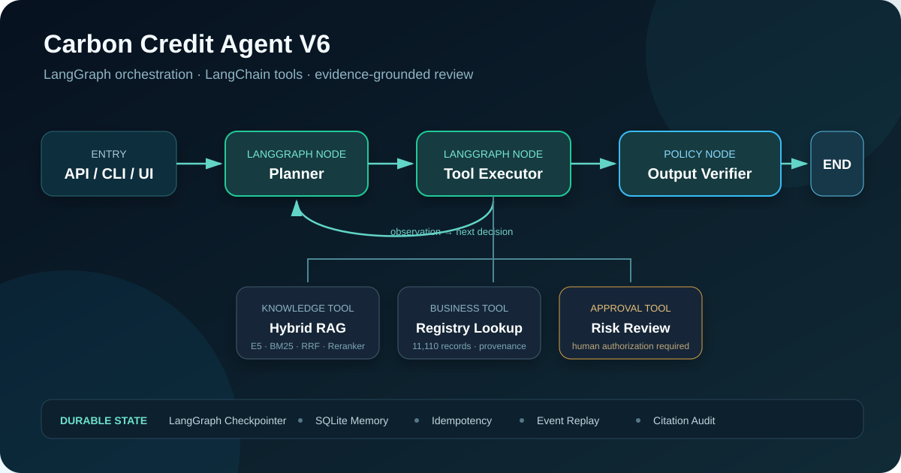

# Carbon Credit Evidence Review Agent

[](https://github.com/hhhttyzuishuai/carbon-credit-evidence-rag/actions/workflows/agent-tests.yml)
[](https://www.python.org/)
[](https://github.com/langchain-ai/langgraph)
[](https://github.com/langchain-ai/langchain)
[](LICENSE)

一个面向碳信用披露审核的可追溯 Agent。系统根据问题调用知识检索、项目登记查询
或实验性风险审核工具，并在返回结果前检查参数、审批状态和证据引用。

仓库同时保留自研 Agent Harness 和 LangGraph Runtime。两套运行时共用相同的工具、
安全规则与回归数据，用于比较手写执行循环和框架化状态图在行为、恢复方式与编排
开销上的差异。

> 本项目是研究和工程原型，不提供法律、合规或审计意见，也不会自动判定企业是否
> 存在绿洗行为。



## 功能

- 使用 LangGraph 编排 Planner、Tool Executor 和 Output Verifier；
- 使用 LangChain `StructuredTool` 定义带 Pydantic Schema 的工具接口；
- 通过 DeepSeek API 完成模型决策和标准 Tool Calling；
- 支持中英文 Dense、BM25、RRF 与 Cross-Encoder 检索；
- 支持项目登记记录精确查询和行级来源追踪；
- 支持 SQLite 多轮记忆、请求幂等、检查点和失败恢复；
- 敏感风险工具执行前必须获得显式审批；
- 提供 CLI、FastAPI、Streamlit 和只读 MCP Server；
- 审计日志会递归脱敏，不记录模型隐藏推理过程。

## 运行时

| 对比项 | Custom Harness | LangGraph Runtime |
|---|---|---|
| 模型接口 | OpenAI-compatible Planner | `ChatDeepSeek` |
| 工具接口 | 自定义 `ToolSpec` | LangChain `StructuredTool` |
| 编排方式 | 有界 Python 循环 | `StateGraph` 节点与条件边 |
| 检查点 | SQLite Execution Store | LangGraph SQLite Checkpointer |
| 恢复机制 | 事件账本与显式状态恢复 | 节点检查点与幂等账本 |
| 切换方式 | `--runtime custom` | `--runtime langgraph` |

默认使用 LangGraph Runtime。完整设计差异见
[Runtime comparison](docs/RUNTIME_COMPARISON.md)。

## 快速开始

### 1. 创建 Python 3.10 环境

Windows PowerShell：

```powershell
git clone https://github.com/hhhttyzuishuai/carbon-credit-evidence-rag.git
Set-Location carbon-credit-evidence-rag

py -3.10 -m venv .venv
& .\.venv\Scripts\python.exe -m pip install --upgrade pip
& .\.venv\Scripts\python.exe -m pip install -r requirements-dev.txt
```

项目声明支持 Python 3.10 及以上版本。本仓库的 Windows 本地验证环境为
Python 3.10.11。

`sentence-transformers` 会安装可用的 PyTorch。需要 CUDA 时，请先按照
[PyTorch 官方安装说明](https://pytorch.org/get-started/locally/)安装与显卡匹配的
版本，再安装本项目依赖。

### 2. 配置 DeepSeek

```powershell
Copy-Item .env.example .env
```

编辑 `.env`：

```dotenv
DEEPSEEK_API_KEY=your_api_key
DEEPSEEK_MODEL=deepseek-v4-flash
DEEPSEEK_BASE_URL=https://api.deepseek.com
DEEPSEEK_THINKING=disabled
```

Agent 工具循环默认关闭思考模式，避免额外推理 token 干扰标准 Tool Calling。需要
实验思考模式时可改为 `enabled`，同时应提高输出 token 上限并保留工具回合中的
`reasoning_content`。

`.env` 已加入 `.gitignore`。不要把 API Key 写进源码、日志或提交记录。

### 3. 启动可视化控制台

```powershell
& .\.venv\Scripts\python.exe -m streamlit run src\step_13_streamlit_app.py
```

打开 <http://localhost:8501>。页面包含：

- Agent 控制台和 V5/V6 运行时切换；
- LangGraph 节点与条件边；
- 工具轨迹、来源、审批状态和执行事件；
- 双运行时回归指标；
- Dense、BM25、RRF 与 Cross-Encoder 检索指标。

架构和离线指标不依赖 API Key。执行真实问题时会读取 `.env` 中的 DeepSeek
配置；知识检索还需要本地语料、索引和模型。

## 命令行

LangGraph：

```powershell
& .\.venv\Scripts\python.exe -m carbon_agent.cli run `
  "Article 6.2 有哪些要求？请引用本地证据。" `
  --runtime langgraph
```

Custom Harness：

```powershell
& .\.venv\Scripts\python.exe -m carbon_agent.cli run `
  "Article 6.2 有哪些要求？请引用本地证据。" `
  --runtime custom
```

## FastAPI

```powershell
& .\.venv\Scripts\python.exe -m carbon_agent.cli serve `
  --runtime langgraph --port 8000
```

启动后访问 <http://127.0.0.1:8000/docs>。主要接口：

- `GET /health`
- `POST /v1/agent/chat`
- `GET /v1/executions/{request_id}/events`
- `GET /v1/architecture`

## MCP Server

```powershell
& .\.venv\Scripts\python.exe -m carbon_agent.cli mcp-server
```

MCP stdio Server 只暴露 `knowledge_search` 和 `registry_lookup`。需要审批的风险
审核工具不会通过 MCP 暴露。

## 构建本地知识库

原始 PDF、处理后语料、向量索引和模型文件不提交到仓库。把有权使用的 PDF 放入
`data/raw/`，然后依次执行：

```powershell
& .\.venv\Scripts\python.exe src\step_01_pdf_loader.py
& .\.venv\Scripts\python.exe src\step_02_quality_check.py
& .\.venv\Scripts\python.exe src\step_03_chunker.py
& .\.venv\Scripts\python.exe src\step_04_chunk_quality_check.py
& .\.venv\Scripts\python.exe src\step_06_build_dense_index.py
```

检索实现位于 `step_07` 至 `step_10`，评测入口为
`src/step_11_evaluate_retrieval.py`。每个文本块保留来源文件、物理页码、语言和
文档类型，生成结果只能引用本轮检索返回的 Source ID。

登记数据同样采用本地文件。`src/step_14_registry_loader.py` 负责生成规范化记录，
`src/step_15_registry_lookup.py` 按 Project ID 查询。

## 评测

当前知识库实验使用 9 份中英文 PDF，共 797 页、2,572 个文本块。50 条人工标注
问题以来源文件和物理页码作为相关性标准。

| 方法 | Hit@1 | Hit@3 | MRR |
|---|---:|---:|---:|
| Dense Retrieval | 0.540 | 0.720 | 0.656 |
| BM25 | 0.680 | 0.880 | 0.785 |
| RRF Hybrid Retrieval | 0.580 | 0.820 | 0.722 |
| Cross-Encoder Reranker | **0.780** | **0.980** | **0.863** |

Agent 离线回归包括：

- 42 个单元、API 与集成测试；
- 24 条固定路由用例；
- 12 条双运行时工具调用用例；
- 4 条故障注入与检查点恢复用例。

运行全部离线检查：

```powershell
& .\.venv\Scripts\python.exe -m unittest discover -s tests -v
& .\.venv\Scripts\python.exe scripts\evaluate_agent_routes.py
& .\.venv\Scripts\python.exe scripts\evaluate_v5_harness.py
& .\.venv\Scripts\python.exe scripts\evaluate_v6_runtime_comparison.py
```

这些结果来自固定离线数据，不代表开放域工具选择能力或线上服务质量。评测脚本、
输入和输出 Schema 均保存在仓库中，便于重复运行。

## 目录结构

```text
src/carbon_agent/
  harness.py             # Custom Harness
  langgraph_runtime.py   # LangGraph StateGraph Runtime
  langchain_adapter.py   # ChatDeepSeek and StructuredTool adapters
  tooling.py             # Tool registry, validation and approval
  verification.py        # Citation and output verification
  streamlit_app.py       # Streamlit console
tests/                   # Offline tests
data/eval/               # Committed evaluation fixtures
scripts/                 # Reproducible evaluation scripts
docs/releases/           # Versioned design notes
```

## 已知边界

- 登记记录是本地静态快照，不代表登记机构的实时状态；
- 风险模型只能产生实验性审核信号，不能代替人工判断；
- SQLite Checkpointer 适合单机运行，不适合分布式部署；
- 当前没有企业 SSO、RBAC、租户隔离、KMS、队列和线上 SLA；
- 固定回归结果不能外推为真实业务准确率。

## 版本

| 版本 | 主要变化 | Git 标签 |
|---|---|---|
| V1 | 无状态问答与可替换 LLM Gateway | `agent-v1.0.0` |
| V2 | SQLite 多轮记忆 | `agent-v2.0.0` |
| V3 | 知识检索、页码来源与引用校验 | `agent-v3.0.0` |
| V4 | 多 Agent 路由、业务工具、审批与 FastAPI | `agent-v4.0.0` |
| V5 | 自研工具循环、幂等、检查点与 MCP | `agent-v5.0.0` |
| V6 | LangGraph、LangChain、双运行时与可视化 | `agent-v6.0.0` |
| V6.1 | Python 3.10 本地运行、DeepSeek V4 与开源文档 | `agent-v6.1.0` |

各版本的设计记录位于 [docs/releases](docs/releases)。

## 参与贡献

提交 Issue 前请附上 Python 版本、运行命令、错误信息和最小复现步骤。代码改动应
同时添加或更新测试。详细流程见 [CONTRIBUTING.md](CONTRIBUTING.md)。

## License

本项目采用 [MIT License](LICENSE)。数据源、模型和第三方依赖仍受各自许可证与
使用条款约束。
